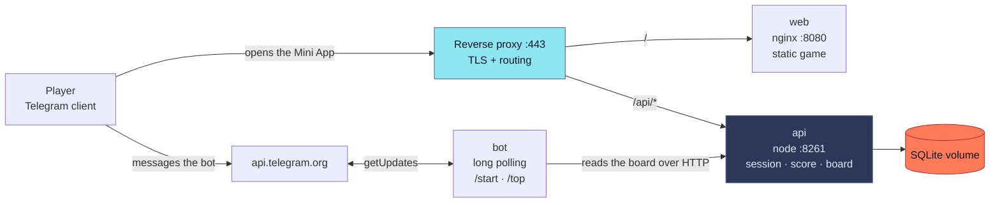
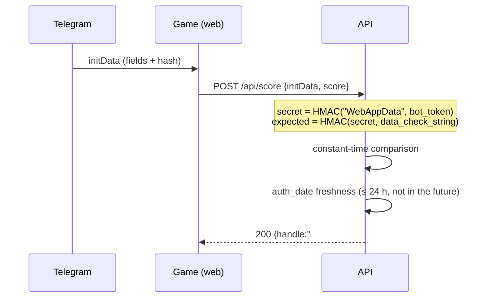

# Architecture

## Principle

The game runs **entirely on the client**. The server never touches gameplay: it
exists to recognise a player from a Telegram signature and to keep records.
A run lasting 20–60 seconds therefore costs exactly two requests.

`api` is the only writer to the database. The bot fetches the leaderboard over the
same HTTP API, so SQLite never has competing writers.

## Authentication

All of it lives in verifying the `initData` blob Telegram hands to the Mini App.

Two details that are easy to get wrong and are pinned by tests:

- The HMAC **key** is the literal `WebAppData` and the **data** is the bot token,
  not the other way round.
- A raw newline inside a field value would let one signature validate two different
  parses of the same string, so newlines and duplicate keys are rejected before any
  cryptography runs.

Forging a hash without the bot token is not possible, so submitting someone else's
score is not possible either. Inflating **your own** score is: the value comes from
the client. It is bounded by a ceiling derived from the engine's physics and by a
time-plausibility check, and that bound is cross-checked against the engine
constants in `tests/plausibility.test.js` — the game and the API ship as separate
images and would otherwise drift apart silently.

## Anonymity

The Telegram id lives only in the database, where it is needed to recognise a
returning player. The public projection is `#<seq> <II>`. No API response carries
an id, a name, a username or a link — and the projection is an allowlist, not a
field deletion.

## Why there is no X-Frame-Options

Telegram Web opens a Mini App in an iframe, so `DENY` would break every web client.
Sources are restricted through `Content-Security-Policy: frame-ancestors` instead.
CI asserts both facts against a running image: the CSP must be present and the
`X-Frame-Options` header must be absent, so nobody "fixes" it from a checklist.

## Capacity

| | |
|---|---|
| Requests per run | 2 (`/api/session`, `/api/score`) |
| Run length | 20–60 s → roughly 0.05 req/s per active player |
| Per-player limit | 30 requests/min, plus a stricter write limit |
| Anonymous limit | applied before signature verification, per client address |

The bottleneck is whatever else shares the host, not the game.
